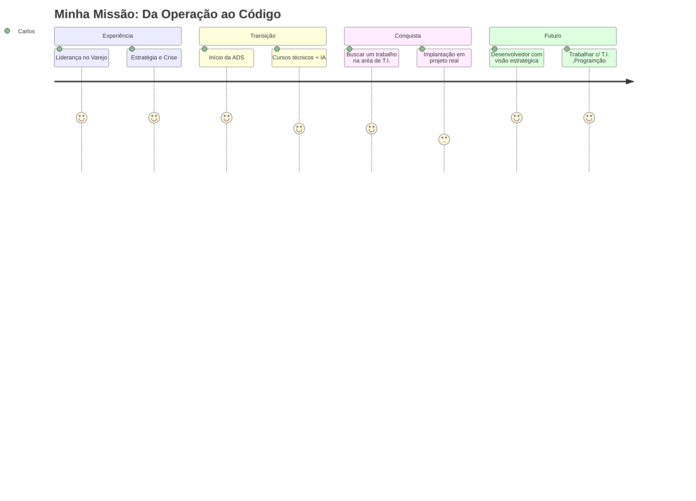

<!-- HEADER -->
<h1 align="center" style="color:#00fff7">Carlos Alberto de Freitas Bastians 🚀</h1>
<p align="center"><strong> Estudante de T.I. |Fazer oque gosta   | Curioso</strong></p>
<p align="center">
  
</p>

---

## 🌌 Sobre mim

Sou um profissional em **transição de carreira** com mais de 8 anos de experiência como **encarregado de loja em uma rede varejista ,Vendas de Bebidas...**.Passando pelos mais variados setores como aux. administrativo até esporte aventuras e controles. Hoje, mergulho com intensidade no mundo da **tecnologia**, estudando, desenvolvendo e sonhando com soluções que unem **inteligência artificial**, automação e impacto real. 

🎓 Estudante de **Análise e Desenvolvimento de Sistemas** sempre gostei muito de tecnologia ,quando pequeno abrria coisas na oficina do Meu pai, Estudando de verdade a 3 meses . Atualmente focado em:

- 📊 Lógica de programação e estrutura de algoritmos
- 🛢️ Banco de dados com **MySQL**
- 🤖 Desenvolvimento com **Python** e **FastAPI**
- ☁️ Infraestrutura com **Docker** e visão para **AWS**
- 🧠 Geração de conteúdo com **Inteligência Artificial aplicada à educação e produtividade**

---

## ⚙️ Habilidades interpessoais & técnicas

```bash
🔹 Liderança de Equipes Multidisciplinares
🔹 Tomada de Decisão sob Pressão (Gestão de Crises)
🔹 Pensamento Estratégico & Visão de Futuro
🔹 Curva de Aprendizado Rápida (Autodidata)
🔹 Comunicação e Engajamento com Times
🔹 Desenvolvimento de APIs e protótipos inteligentes
```

---

## 🧪 Projeto em Destaque – ClickVite

### 🎉 ClickVite – Convites Interativos com Toque de Futuro (logo estarei colocando aqui)

> Aplicação para criação de convites visuais com toque artístico e interativo, permitindo personalização completa em imagens JPEG.

**Funcionalidades:**
- Upload de imagem de fundo
- Escolha de fonte, cores, estilo e mensagens
- Compartilhamento em redes sociais
- Versão para impressão
- Totalmente baseado em **FastAPI + Pillow**

📍 Em desenvolvimento | Futuramente integrado com **IA para criação automatizada de estilos visuais e frases temáticas.**

---

## 🧠 Estudando com IA

Atualmente, exploro ativamente **inteligência artificial como ferramenta de apoio** ao aprendizado e produção:

- Geração de código com assistentes
- Escrita técnica e criativa automatizada
- Testes de produtividade com bots e automações
- Protótipos educacionais para ajudar outros a aprender mais rápido

> "A IA não substitui talento, mas acelera quem tem propósito."

---

## 🧬 Stack Tecnológica


---

## 🌐 Redes e Contato

- 🌎 [LinkedIn – Carlos Bastians](https://www.linkedin.com/in/carlos-bastians-b807b0362)
- 👨‍💻 GitHub: [github.com/KarlosBastian](https://github.com/KarlosBastian)

---

## 🎯 Visão de Futuro



---

<p align="center">
  
</p>

<p align="center">
  
</p>
